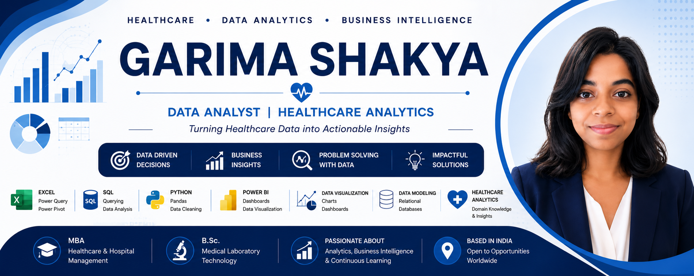

# Hi, I'm Garima Shakya 👋

### Healthcare Data Analyst | MBA in Healthcare & Hospital Management | B.Sc. Medical Laboratory Technology

I am an aspiring **Data Analyst** with a strong healthcare background, passionate about transforming raw data into meaningful business insights. My projects focus on solving real-world healthcare and business problems using Excel, SQL, Python, and Power BI.

---

## About Me

- MBA in Healthcare & Hospital Management
- B.Sc. in Medical Laboratory Technology
- Strong understanding of hospital operations and healthcare workflows
- Passionate about Business Intelligence, Data Analytics, and Dashboard Development
- Currently building an end-to-end Data Analytics Portfolio

---

## Tech Stack

### Data Analysis

### Data Visualization

### Database

### Version Control

---

## Featured Projects

### Hospital HMIS Analysis
Healthcare analytics project using Excel, Power Pivot, Power Query, and interactive dashboards to analyze revenue, admissions, departments, insurance providers, payment modes, and patient demographics.

### SQL Analytics Portfolio
Business-focused SQL projects solving real-world analytical problems using joins, aggregations, KPI calculations, and dashboard-ready datasets.

### Data Cleaning with Python
Practical data cleaning projects using Pandas, covering missing values, data validation, feature engineering, and preprocessing workflows.

---

## Currently Learning

- Advanced SQL
- Statistics for Data Analytics
- Power BI
- Machine Learning Fundamentals

---

## GitHub Statistics

---

## Career Objective

Seeking opportunities as a **Data Analyst** where I can combine healthcare domain expertise with analytical skills to build impactful, data-driven solutions.

## Connect with Me

- LinkedIn: *www.linkedin.com/in/garimashakya9*
- Email: *02garimashakya09@gmail.com*

---

⭐ Thank you for visiting my profile!

